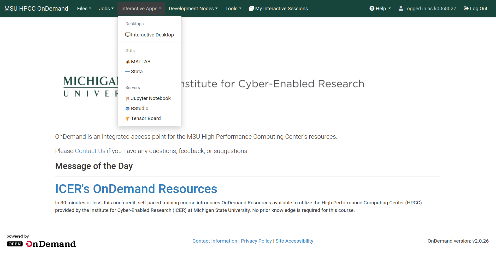
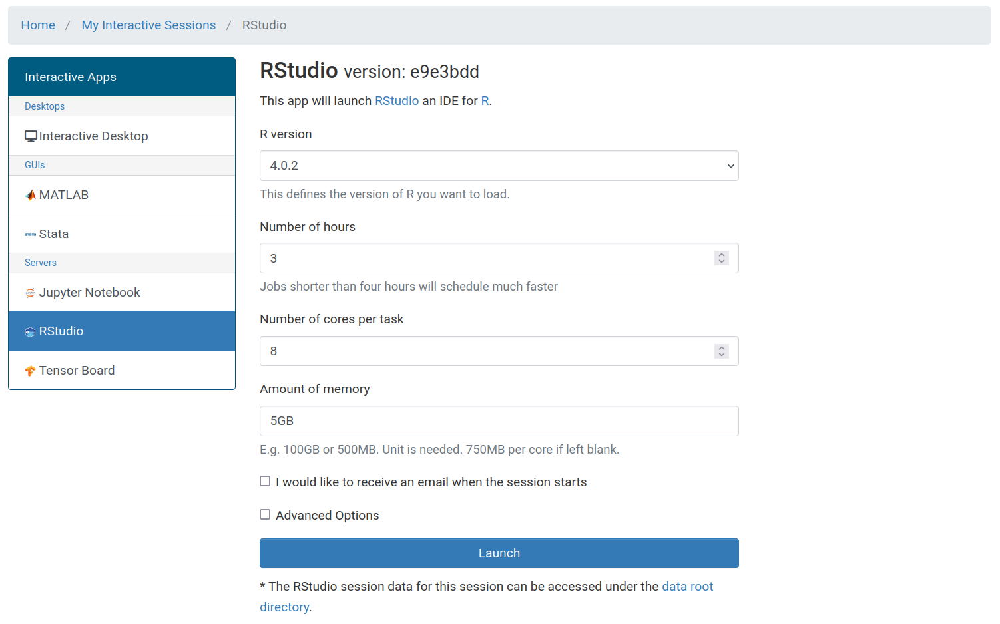
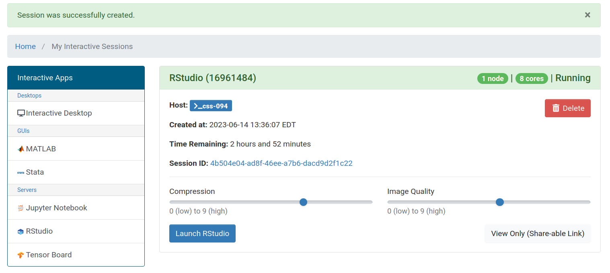
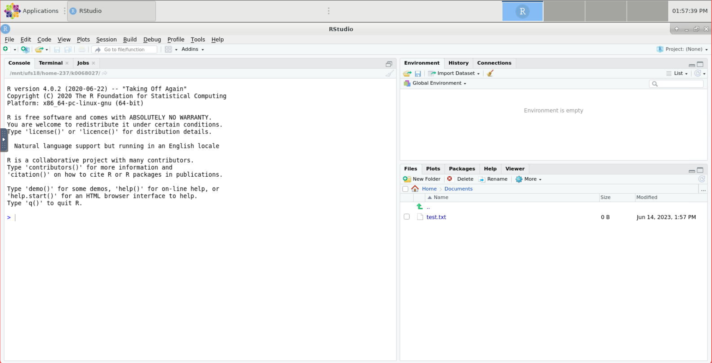
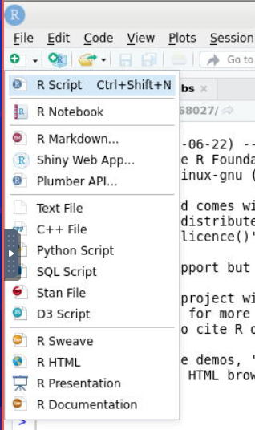
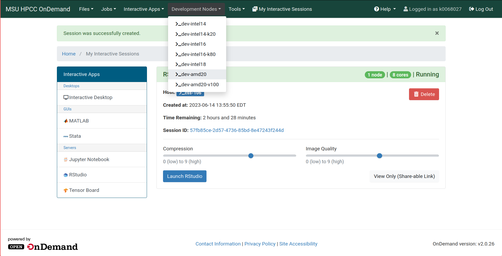
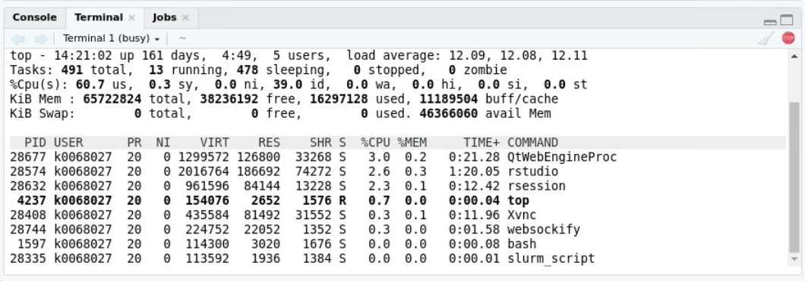

:::::::::::::::::::::::::::::::::::::: questions 

- How can you run RStudio on the HPCC?

::::::::::::::::::::::::::::::::::::::::::::::::

::::::::::::::::::::::::::::::::::::: objectives

- Create an OnDemand session to run RStudio
- Understand the options for creating an OnDemand session
- Access a terminal on the node where your RStudio job is running

::::::::::::::::::::::::::::::::::::::::::::::::

## OnDemand

HPCC resources have traditionally been accessed solely through a terminal.
Though the terminal is still the best way to accomplish many tasks on the HPCC,
launching graphical user interfaces (GUIs) like RStudio is not one of them! This
procedure has been streamlined through the use of OnDemand to run graphical applications through your web browser.

This is where we will start our journey with R on the HPCC, eventually making 
our way back to using R on the command line.

## Starting an RStudio job

We'll begin by logging in on OnDemand. Go to
[https://ondemand.hpcc.msu.edu](https://ondemand.hpcc.msu.edu), If you are prompted, choose Michigan State University as the Identity Provider, and log in using
your MSU NetID and password. Before we get into any other OnDemand specifics,
we'll submit an RStudio job to get you up and running.

Go to the Interactive Apps tab and select RStudio.

{alt='The OnDemand home screen with the Interactive Apps tab expanded to show RStudio'}

On the following screen you will be able to choose the options for your RStudio job. For this workshop, you should use the following options:

- R version: 4.0.2
- Number of hours: 3
- Number of cores per task: 8
- Amount of memory: 5GB

{alt='The RStudio OnDemand setup screen with text boxes for the four options listed above filled in using the values specified.'}

If you need to specify any other options (for example, if you want to run your session on a buy-in node and specify your SLURM account), you can click the Advanced Options checkbox and enter additional information.

Select the Launch button and wait for your job to start. When your job is ready, you will see a card with all of the information for your job. The most important fields for now are the Host which is the node on the HPCC where you job is running and the Time Remaining which counts down from the requested number of hours.

{alt="An OnDemand card with the information for a running RStudio job. The Host is css-094, the Time Remaining is 2 hours and 52 minutes, the compression slider is set to approximately 6 out of 9 and the Image Quality slider is approximately 5 out of 9."}

You can move the Compression and Image Quality sliders to change the quality and responsiveness of the RStudio session. Generally, moving the sliders somewhere between 5 to 7 works well, but for slower internet connections, you might prefer a lower quality and higher compression.

When you're ready to access RStudio, you can click the Launch RStudio button. If you ever navigate away from this screen, you can always return to it by clicking the My Interactive Sessions button in the OnDemand navigation bar. On less wide screens, this button shrinks down to a graphic of a pair of overlapping cards next to the Tools dropdown.

## RStudio

After Launching your RStudio session, a new tab in your browser will show an interactive desktop with RStudio running. If you are asked to update Rstudio, select Ignore Update. You may also need to maximize the RStudio window to your current browser size with the square button next to the "X" in the top right corner.

{alt="An interactive desktop showing a new RStudio session. An R console takes up the left half of RStudio, and the right half is split between an environment section on top and a file browser on bottom."}

On startup, there are three main sections to RStudio: an R console, an environment section, and a file browser. Notice that the file browser starts in your HPCC home directory.

:::::::::::::::::::::::::::::::::::::::::::::::::::::::::::::::::::: instructor

Inline instructor notes can help inform instructors of timing challenges
associated with the lessons. They appear in the "Instructor View"

::::::::::::::::::::::::::::::::::::::::::::::::::::::::::::::::::::::::::::::::

::::::::::::::::::::::::::::::::::::: challenge 

## Open a file

Use the RStudio interface to create a new R Script file.

:::::::::::::::::::::::: solution 

Click the button that looks like a page with a plus sign right below the file menu and choose R Script.

{alt="The new document button in RStudio expanded to show options like 'R Script' and 'R Markdown'."}

Notice that the R console shrinks to make room for the text editor.

:::::::::::::::::::::::::::::::::


::::::::::::::::::::::::::::::::::::::::::::::::

## Connect to your RStudio node from the command line

As discussed earlier, OnDemand tells you the Host that your RStudio job is running on. From time to time, you may need to run commands on this host from a command line. You have two options.

### The RStudio terminal

Handily, RStudio provides a terminal for you to use! Right next to the R console, is a Terminal tab. Clicking this tab will start a terminal on the same node that RStudio is running on.

{alt="The terminal tab in RStudio showing a terminal connected to the host css-106"}


### SSH

This can be accomplished through any terminal that you can SSH to the HPCC on. Since we're already using OnDemand, we'll use the built-in terminal.

Returning to the OnDemand window, open the Development Nodes dropdown from the navigation bar.

{alt="The Development Nodes dropdown from the OnDemand navigation bar showing the development nodes accessible on the HPCC"}

Choose any development node, and a new tab will open with a terminal on that node.

:::::::::::::::::::::::::: callout

## SSH outside of OnDemand

If you are not using an OnDemand terminal, you first need to manually SSH into a development node. From your terminal (e.g., the built in terminal on Mac or MobaXterm on Windows), SSH into the gateway via `ssh <netid>@hpcc.msu.edu`, then SSH into a development node, e.g., `ssh dev-amd20`.

::::::::::::::::::::::::::::::::::

Now find the Host your RStudio session is running on (remember, this information is always available in the My Interactive Jobs section in OnDemand), and in the development node terminal type 

```bash
ssh <host>
```

replacing `<host>` by the host your RStudio session is running on.

::::::::::::::::::::::::::::::::::: challenge

Run the `top` command via command line on the node your RStudio session is running on and verify that indeed RStudio is running there.

*Hint*: If your node is busy, you can use `top -u <netid>` (replacing `<netid>` with your username) to see just your running processes.

::::::::::::::::::::::::::: solution

Running `top -u k0068027` (my username) from the RStudio terminal shows the `rstudio` command in the `COMMAND` column.

{alt="The top command running through the RStudio terminal. In addition to some auxiliary processes, one row in the top output has 'rstudio' in the COMMAND column."}

Depending on your screen width, you may have to use the arrow keys to scroll to the right and see the `COMMAND` column.

::::::::::::::::::::::::::::::::::::

:::::::::::::::::::::::::::::::::::::::::::::

::::::::::::::::::::::::::::::::::::: keypoints 

- Start an RStudio session from [OnDemand](https://ondemand.hpcc.msu.edu)
- Access the command line of the node your process is running on through the RStudio terminal or SSH into the host OnDemand provides you.

::::::::::::::::::::::::::::::::::::::::::::::::

